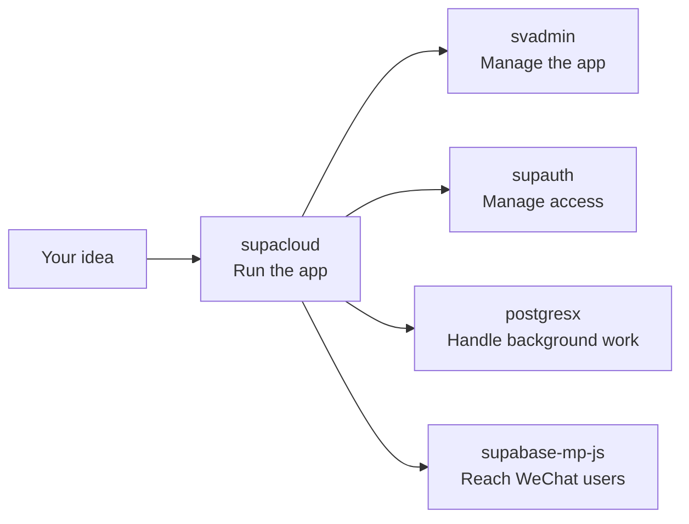
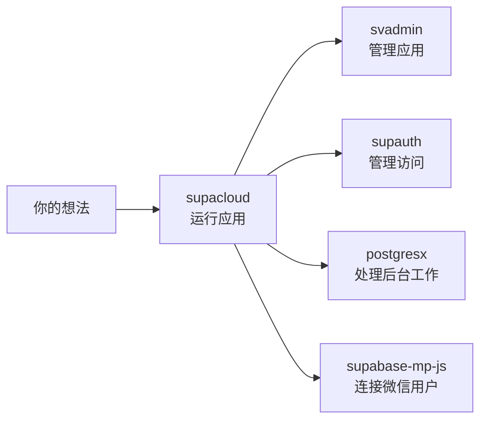

# vibeunion/.github

[English](#english) | [中文](#中文)

---

## English

VibeUnion makes practical building blocks for vibecoding: describe what you want to build, let AI help write the code, and add only the pieces your product needs.

> The [`profile/README.md`](./profile/README.md) in this repo is auto-rendered on the [VibeUnion GitHub organization page](https://github.com/vibeunion).

### Contents

- [`profile/`](./profile) — Organization profile README (bilingual EN/ZH), auto-rendered on the org homepage
- [`SKILLS.md`](./SKILLS.md) — Codex skills installation and usage guide (bilingual EN/ZH)

### Start With Your Idea

| I want to... | Start here |
| --- | --- |
| Put my app online with a database, login, and file storage | [supacloud](https://github.com/vibeunion/supacloud) |
| Add a ready-made admin screen | [svadmin](https://github.com/vibeunion/svadmin) |
| Add users, teams, roles, and permissions | [supauth](https://github.com/vibeunion/supauth) |
| Add caching, queues, and rate limits without Redis | [postgresx](https://github.com/vibeunion/postgresx) |
| Connect a WeChat mini-program to Supabase | [supabase-mp-js](https://github.com/vibeunion/supabase-mp-js) |

| Growth stage | Main question | Add |
| --- | --- | --- |
| 1. Make it work | Where do my data and app services live? | supacloud |
| 2. Make it manageable | How do I manage content and users? | svadmin |
| 3. Make it a product | How do teams and permissions work? | supauth |
| 4. Make it reliable | How do caching and background jobs work? | postgresx |
| 5. Reach more users | How do I support WeChat? | supabase-mp-js |

### What Each Project Does

- **supacloud** runs your app's database, login, storage, server functions, realtime features, and deployments.
- **svadmin** helps you build screens for managing users, content, orders, settings, and permissions.
- **supauth** adds hosted login, teams, organizations, roles, invitations, and audit history.
- **postgresx** provides common app utilities such as cache, counters, background jobs, locks, and events using PostgreSQL.
- **supabase-mp-js** lets a WeChat mini-program use the same Supabase backend as your web app.

### How They Fit Together

You can use one project by itself. A product can grow step by step:

1. Start with **supacloud**.
2. Add **svadmin** when people need to manage the app.
3. Add **supauth** when login grows into teams and permissions.
4. Add **postgresx** when the app needs background work or caching.
5. Add **supabase-mp-js** when you also want a WeChat mini-program.

In plain language: **supacloud runs the product, supauth manages access, svadmin helps people operate it, postgresx handles background work, and supabase-mp-js brings it to WeChat.**

### License

MIT

---

## 中文

VibeUnion 为 vibecoding 提供实用的开源积木：你先说清楚想做什么，再让 AI 帮你写代码，用一组简单、可复用的工具，把想法逐步做成真正能用的产品。

> 本仓库的 [`profile/README.md`](./profile/README.md) 会自动渲染到 [VibeUnion GitHub 组织主页](https://github.com/vibeunion)。

### 目录

- [`profile/`](./profile) — 组织主页 README（中英双语），自动渲染到组织首页
- [`SKILLS.md`](./SKILLS.md) — Codex skills 安装与使用指南（中英双语）

### 先从想法开始

| 我想做什么 | 从这里开始 |
| --- | --- |
| 让应用拥有数据库、登录和文件存储 | [supacloud](https://github.com/vibeunion/supacloud) |
| 快速做一个后台管理界面 | [svadmin](https://github.com/vibeunion/svadmin) |
| 增加用户、团队、角色和权限 | [supauth](https://github.com/vibeunion/supauth) |
| 不部署 Redis，也想做缓存、队列和限流 | [postgresx](https://github.com/vibeunion/postgresx) |
| 让微信小程序连接 Supabase | [supabase-mp-js](https://github.com/vibeunion/supabase-mp-js) |

| 成长阶段 | 你要解决的问题 | 添加 |
| --- | --- | --- |
| 1. 先做出来 | 数据和应用服务放在哪里？ | supacloud |
| 2. 方便管理 | 如何管理内容和用户？ | svadmin |
| 3. 做成产品 | 团队和权限怎么处理？ | supauth |
| 4. 更稳定 | 缓存和后台任务怎么处理？ | postgresx |
| 5. 触达更多用户 | 如何支持微信？ | supabase-mp-js |

### 每个项目做什么

- **supacloud** 负责运行应用的数据库、登录、存储、服务端函数、实时功能和部署。
- **svadmin** 帮你制作用户、内容、订单、设置和权限管理界面。
- **supauth** 增加托管登录、团队、组织、角色、邀请和操作记录。
- **postgresx** 使用 PostgreSQL 提供缓存、计数、后台任务、锁和事件等常见能力。
- **supabase-mp-js** 让微信小程序和网页应用共用同一个 Supabase 后端。

### 它们如何配合

你可以只使用其中一个项目，也可以逐步增加能力：

1. 先从 **supacloud** 开始。
2. 需要管理应用时，加上 **svadmin**。
3. 登录发展成团队和权限时，加上 **supauth**。
4. 需要后台任务或缓存时，加上 **postgresx**。
5. 需要微信小程序时，加上 **supabase-mp-js**。

用一句话概括：**supacloud 运行产品，supauth 管理访问权限，svadmin 帮人管理产品，postgresx 处理后台工作，supabase-mp-js 把产品带到微信。**

### 许可证

MIT
