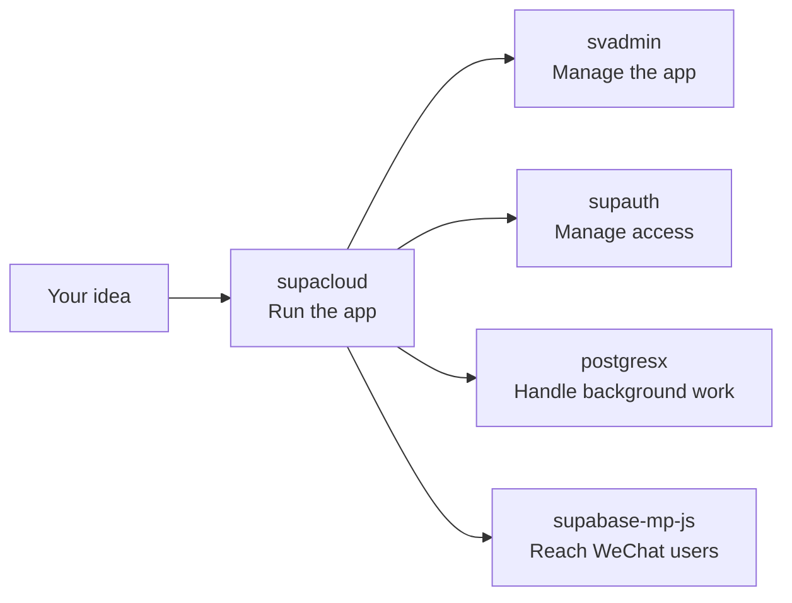
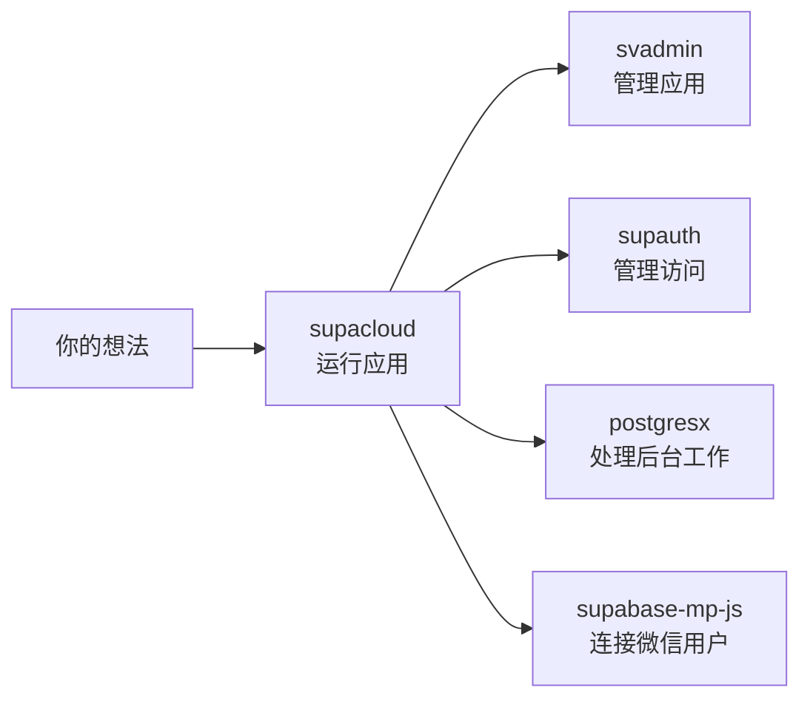

# VibeUnion

  <strong>Infrastructure for vibecoding. / 为 vibecoding 而生的基础设施。</strong>

  <a href="#english">English</a> · <a href="#中文">中文</a>

---

## English

VibeUnion makes practical building blocks for vibecoding: describe what you want to build, let AI help write the code, and add only the pieces your product needs.

You do not need to learn the whole stack before starting. Pick the part you need today and add the rest when your project grows.

### Start With Your Idea

| I want to... | Start here |
| --- | --- |
| Put my app online with a database, login, file storage, and APIs | [supacloud](https://github.com/vibeunion/supacloud) |
| Add a ready-made admin or management screen | [svadmin](https://github.com/vibeunion/svadmin) |
| Add user login, teams, roles, and an organization center | [supauth](https://github.com/vibeunion/supauth) |
| Make my app faster without running a separate Redis server | [postgresx](https://github.com/vibeunion/postgresx) |
| Connect a WeChat mini-program to Supabase | [supabase-mp-js](https://github.com/vibeunion/supabase-mp-js) |

| Growth stage | Main question | Add |
| --- | --- | --- |
| 1. Make it work | Where do my data and app services live? | supacloud |
| 2. Make it manageable | How do I manage content and users? | svadmin |
| 3. Make it a product | How do teams and permissions work? | supauth |
| 4. Make it reliable | How do caching and background jobs work? | postgresx |
| 5. Reach more users | How do I support WeChat? | supabase-mp-js |

### The Projects

#### [supacloud](https://github.com/vibeunion/supacloud) — The Place Your App Runs

SupaCloud is a self-hosted home for Supabase-style projects. It gives you a database, login, file storage, realtime updates, server functions, logs, and a web console on infrastructure you control.

Useful when you want to:

- Run several small apps on one affordable server
- Start locally with the lightweight SupaCloud Lite edition
- Deploy a frontend from GitHub and manage projects from a browser
- Add social login, background jobs, realtime notifications, or automatic scaling later

Think of it as the foundation: your app, its data, and the services around it live in one place.

#### [svadmin](https://github.com/vibeunion/svadmin) — The Admin Screens You Do Not Want to Build From Scratch

Svadmin helps you make the screens used to manage an app: user lists, orders, content, settings, reports, and permissions. It works with different backends, so the UI does not lock you into one database or service.

Useful when you want to:

- Turn a database into a usable admin panel quickly
- Add tables, forms, search, filters, import, and export
- Give different staff members different permissions
- Support light/dark mode, multiple languages, and realtime updates

It includes ready-to-use components and hooks, plus adapters for Supabase, REST, GraphQL, Firebase, and other common backends.

#### [supauth](https://github.com/vibeunion/supauth) — Login, Teams, and Permissions

Supauth adds the parts of user management that a real product usually needs after basic login: hosted sign-in pages, team or organization accounts, roles, permissions, audit history, and an admin console.

Useful when you want to:

- Let users sign up and sign in without designing every screen yourself
- Support teams, organizations, invitations, and roles
- Give owners and staff a place to manage users and access
- Keep using the normal Supabase Auth behavior underneath

Supauth is an extra layer on top of Supabase Auth. You can start with simple login and add organization features when your product needs them.

#### [postgresx](https://github.com/vibeunion/postgresx) — Common App Utilities, Using Your Database

Postgresx provides everyday app utilities such as caching, counters, locks, rate limits, queues, and events using PostgreSQL. That means a small project can avoid adding and maintaining a separate Redis service.

Useful when you want to:

- Cache data or count views and requests
- Prevent two jobs from running at the same time
- Limit repeated requests
- Run background jobs and send events between parts of an app
- Keep the first version of your infrastructure small

It supports Bun and Node.js and can also make migration easier for code that already uses Redis-style client methods.

#### [supabase-mp-js](https://github.com/vibeunion/supabase-mp-js) — Supabase in WeChat Mini-Programs

Supabase works well on the web, but WeChat mini-programs use different networking, storage, socket, and file-upload APIs. This package adapts the official Supabase JavaScript client to that environment.

Useful when you want to:

- Build a WeChat mini-program with the same backend as your web app
- Reuse Supabase login, database queries, storage, and realtime features
- Keep the official Supabase API instead of learning a completely different client
- Move between web and WeChat without maintaining two separate data layers

### How They Fit Together

You can use one project by itself. A typical product grows like this:

1. Start with **supacloud** for the database, login, storage, and server-side features.
2. Add **svadmin** when you need a screen to manage users, content, orders, or settings.
3. Add **supauth** when simple login grows into teams, roles, invitations, and audit history.
4. Add **postgresx** when the app needs caching, background jobs, request limits, or event handling.
5. Add **supabase-mp-js** when the same product needs a WeChat mini-program.

In plain language:

**supacloud runs the product, supauth manages who can use it, svadmin helps people operate it, postgresx handles common behind-the-scenes work, and supabase-mp-js brings it to WeChat.**

### Skills

We publish [Codex skills](https://developers.openai.com/codex) to help AI agents work with these projects. See [our skills guide](./SKILLS.md) for installation and usage.

---

## 中文

VibeUnion 为 **vibecoding** 提供实用的开源积木：你先说清楚想做什么，再让 AI 帮你写代码，用一组简单、可复用的工具，把想法逐步做成真正能用的产品。

你不需要一开始就学完整套技术栈。今天需要什么，就先用什么；项目变大以后，再按需要添加其他能力。

### 先从想法开始

| 我想做什么 | 从这里开始 |
| --- | --- |
| 让应用拥有数据库、登录、文件存储并上线运行 | [supacloud](https://github.com/vibeunion/supacloud) |
| 快速做一个后台管理界面 | [svadmin](https://github.com/vibeunion/svadmin) |
| 增加用户、团队、角色和组织管理 | [supauth](https://github.com/vibeunion/supauth) |
| 不单独部署 Redis，也想做缓存、队列和限流 | [postgresx](https://github.com/vibeunion/postgresx) |
| 让微信小程序连接 Supabase | [supabase-mp-js](https://github.com/vibeunion/supabase-mp-js) |

| 成长阶段 | 你要解决的问题 | 添加 |
| --- | --- | --- |
| 1. 先做出来 | 数据和应用服务放在哪里？ | supacloud |
| 2. 方便管理 | 如何管理内容和用户？ | svadmin |
| 3. 做成产品 | 团队和权限怎么处理？ | supauth |
| 4. 更稳定 | 缓存和后台任务怎么处理？ | postgresx |
| 5. 触达更多用户 | 如何支持微信？ | supabase-mp-js |

### 五个项目

#### [supacloud](https://github.com/vibeunion/supacloud) —— 应用运行的地方

SupaCloud 是一个可以自己部署的 Supabase 风格后端。它把数据库、登录、文件存储、实时更新、服务端函数、日志和网页控制台放在一起，让你可以在自己控制的服务器上运行应用。

适合这些场景：

- 想在一台价格合适的服务器上运行多个小应用
- 想先用轻量的 SupaCloud Lite 在本地开始
- 想从 GitHub 部署前端，并通过浏览器管理项目
- 以后可能需要社交登录、后台任务、实时通知或自动扩缩容

可以把它理解成应用的地基：数据、登录和周边服务都在这里运行。

#### [svadmin](https://github.com/vibeunion/svadmin) —— 不用从零开始写后台

Svadmin 用来快速制作管理应用的界面，例如用户列表、订单、内容、设置、报表和权限管理。它可以连接不同后端，不会把你的界面锁死在某一种数据库或服务上。

适合这些场景：

- 想快速把数据库变成能用的管理后台
- 需要表格、表单、搜索、筛选、导入和导出
- 需要给不同工作人员分配不同权限
- 需要中英文、暗色模式或实时更新

它提供现成的界面组件和开发工具，也支持 Supabase、REST、GraphQL、Firebase 等常见后端。

#### [supauth](https://github.com/vibeunion/supauth) —— 登录、团队和权限

Supauth 处理真实产品在基础登录之外经常需要的功能：托管登录页、团队或组织账号、角色、权限、操作记录和管理后台。

适合这些场景：

- 不想自己从零设计注册和登录页面
- 需要团队、组织、邀请和角色
- 需要让管理员管理用户和访问权限
- 仍然希望继续使用标准 Supabase Auth

Supauth 是 Supabase Auth 上面的增强层。你可以先做简单登录，产品真的需要团队和组织功能时再加上它。

#### [postgresx](https://github.com/vibeunion/postgresx) —— 用数据库完成常见的小工具

Postgresx 使用 PostgreSQL 提供缓存、计数、锁、限流、队列和事件等常见能力。这样，小项目不必一开始就额外部署和维护 Redis。

适合这些场景：

- 缓存数据，或统计访问量和请求量
- 防止同一个后台任务被重复执行
- 限制短时间内的重复请求
- 执行后台任务，并在应用之间传递事件
- 希望第一版基础设施尽量简单

它支持 Bun 和 Node.js，也能帮助已经使用 Redis 风格方法的项目逐步迁移。

#### [supabase-mp-js](https://github.com/vibeunion/supabase-mp-js) —— 在微信小程序里使用 Supabase

Supabase 在网页端很好用，但微信小程序有自己的网络、存储、Socket 和文件上传接口。这个项目把官方 Supabase JavaScript 客户端适配到微信小程序环境。

适合这些场景：

- 想让微信小程序和网页使用同一个后端
- 想复用 Supabase 登录、数据库查询、存储和实时能力
- 不想重新学习一套完全不同的客户端 API
- 想让网页端和微信端共享同一套数据逻辑

### 它们如何配合

你可以只使用其中一个项目。一个产品通常可以这样逐步成长：

1. 先用 **supacloud** 提供数据库、登录、文件存储和服务端能力。
2. 需要管理用户、内容、订单或设置时，加上 **svadmin**。
3. 简单登录发展成团队、角色、邀请和操作记录时，加上 **supauth**。
4. 需要缓存、后台任务、请求限制或事件处理时，加上 **postgresx**。
5. 需要微信小程序时，加上 **supabase-mp-js**。

用一句话概括：

**supacloud 负责运行产品，supauth 管理谁能使用，svadmin 帮人管理产品，postgresx 处理后台杂务，supabase-mp-js 把产品带到微信。**

### Skills

我们发布了 [Codex skills](https://developers.openai.com/codex)，帮助 AI Agent 更好地使用这些项目。安装与使用请参考 [skills 指南](./SKILLS.md)。

---

  Built with intent. / 以意图驱动。

